# Plai

**A standalone Meshtastic communicator for M5Stack CardPuter**

> _Plai_ is the Ukrainian word for a mountain trail — a reliable path for your data to travel when you're off the beaten track.

<p align="center">
  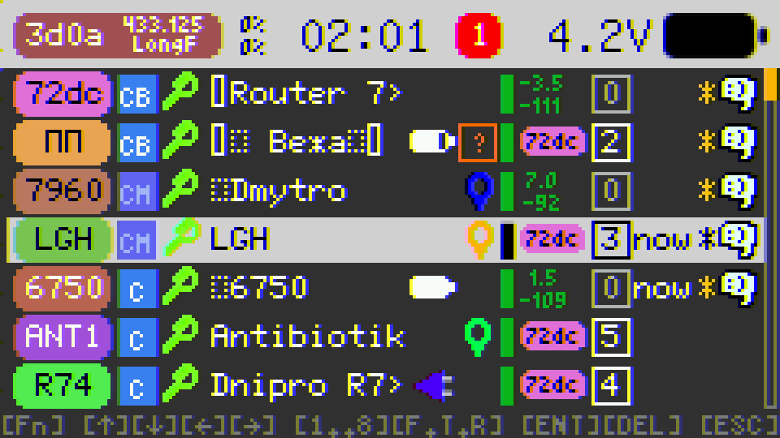
</p>

Most Meshtastic nodes rely on a phone via BLE or WiFi. Plai takes a different approach: it turns the CardPuter into a **self-contained messaging terminal**. No phone required — just you, the LoRa CAP, and the keyboard.

## Why Plai?

- **Full standalone operation** — No WiFi, no BLE. Direct LoRa mesh communication with on-device UI.
- **Unlimited message history** — The entire profile, message history, and node database live on the SD card. Storage is limited only by your card size.
- **Swap and survive** — Reboot or switch firmwares without losing your place in the mesh. Everything persists on SD.
- **Pro navigation** — PgUp / PgDown / Home / End for fast scrolling through long threads and node lists.
- **Debug tools** — Built-in Packet Monitor (last 50 packets) and Trace Route history (last 50 attempts per node).
- **Custom alerts** — Individual channel notifications with distinct sounds.
- **Fully compatible** with Meshtastic network v2.7+

## Apps

### Nodes

Full node management with up to 1000 nodes persisted on SD card.

<p align="center">
  
  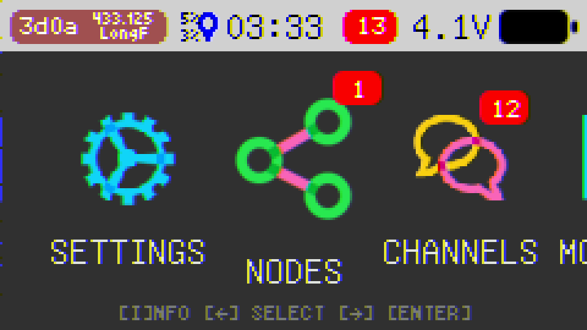
</p>

- Node list with signal strength, hops, battery, role, encryption indicators
- 8 sorting modes (name, role, signal, hops, last heard, favorites, etc.) _hotkey_ for sorting [1..8], [TAB] to select sorting mode
- Relay node display — see which node relayed each packet _hotkey_ [R] to jump to relay node
- Favorite marking and quick-jump navigation _hotkey_ [F] to toggle favorite
- Node detail view with hardware model, position, and metrics _hotkey_ [Fn] + [ENTER] to open
- Direct Messages _hotkey_ [ENTER] to open
- Traceroute _hotkey_ [T] to open recent traceroute logs. [Fn] + [T] to start traceroute immediately

#### Direct Messages

<p align="center">
  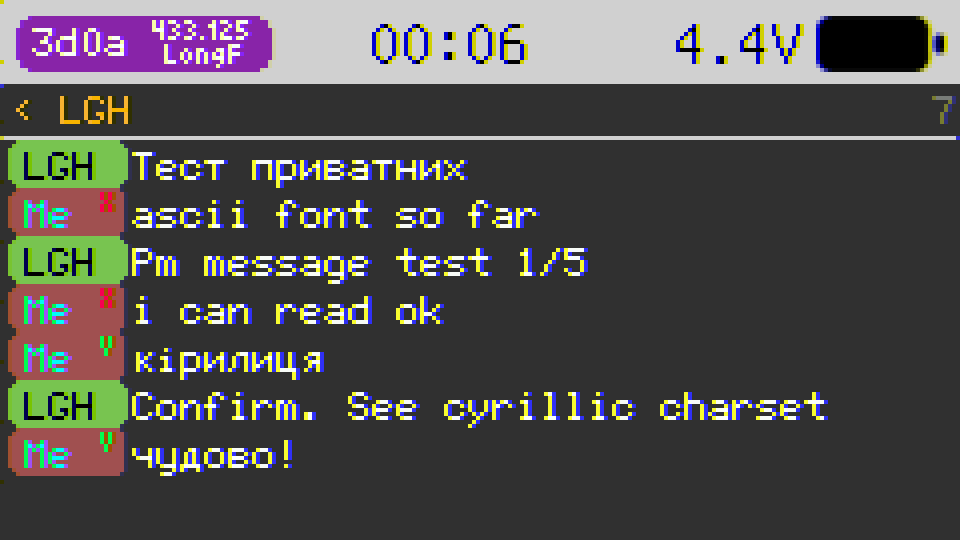
  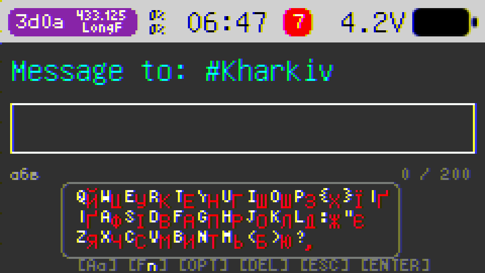
</p>

- Direct messaging with delivery status (pending → sent → ACK → delivered → failed)
- Full keyboard input with Cyrillic layout support
- File-backed message history on SD card
- Clear chat _hotkey_ [BACKSPACE] to clear all messages
- Hold [CTRL] to display message info (timestamp, will be more soon...)

#### Traceroute

<p align="center">
  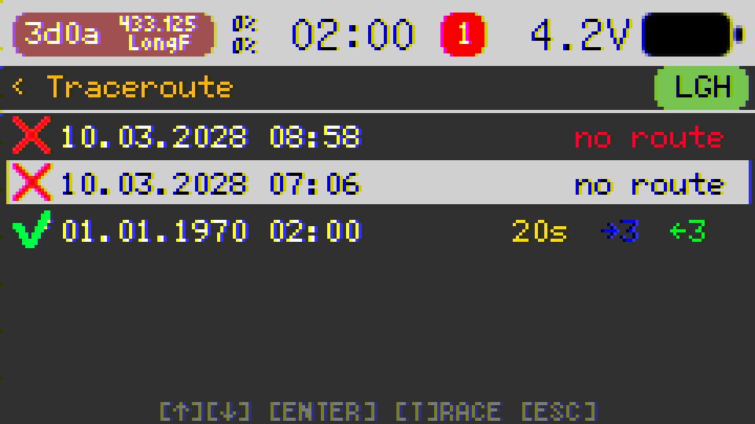
  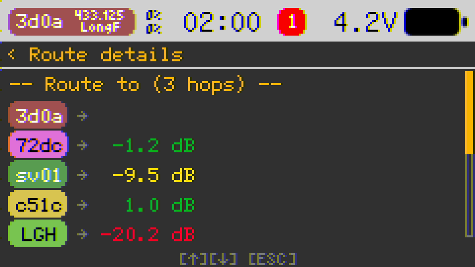
</p>

- Traceroute with hop-by-hop detail, round-trip duration, and SNR at each hop
- Last 50 traceroute attempts stored per node
- Visual route map with color-coded signal quality
- Press [T] to start new traceroute

### Channels

Multi-channel group chat supporting up to 8 channels.

<p align="center">
  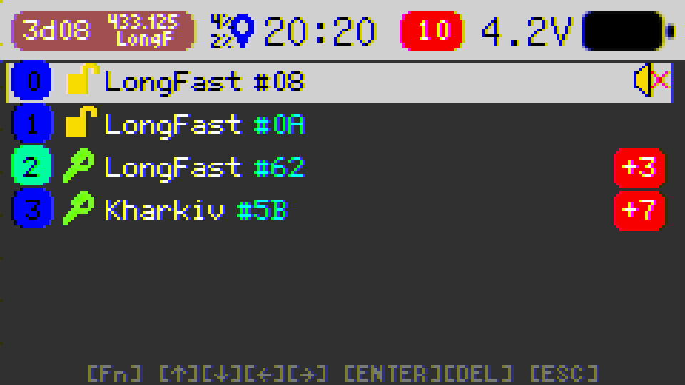
  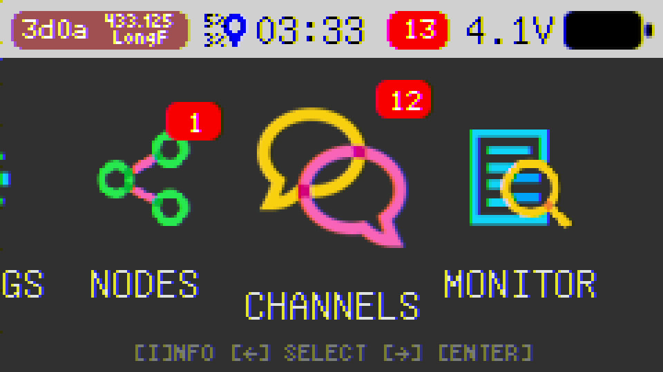
</p>
<p align="center">
  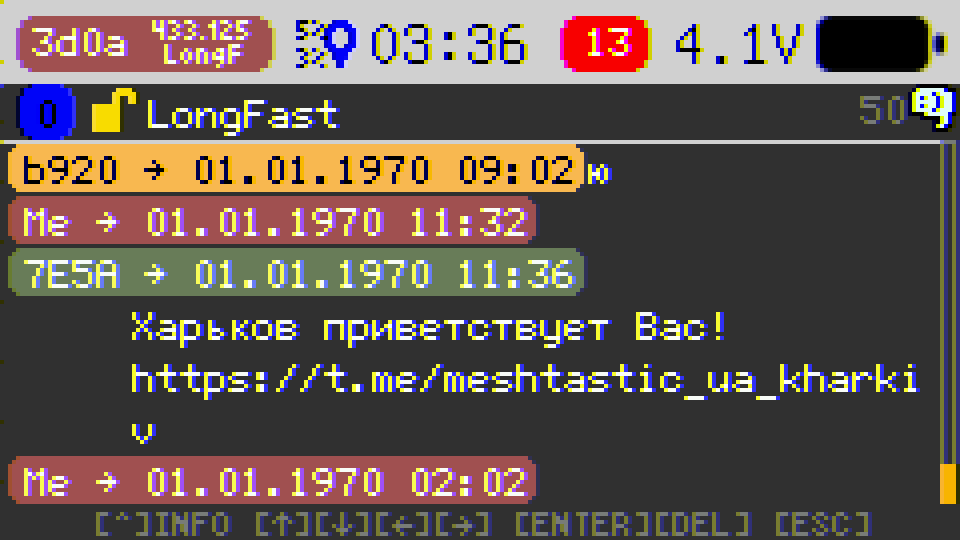
</p>

- Channel list with unread message counts
- Channel creation _hotkey_ [Fn] + [SPACE] to open channel creation dialog
- Channel editing _hotkey_ [Fn] + [ENTER] to open channel editing dialog
- Channel chat _hotkey_ [ENTER] to open channel chat
- Individual notification sounds per channel

### Monitor

Live radio packet feed for debugging and network analysis.

<p align="center">
  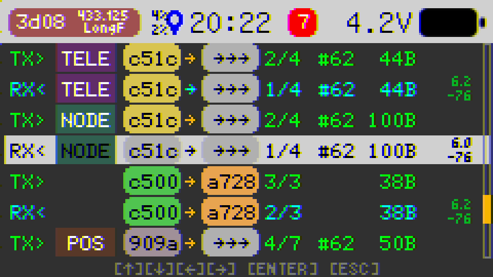
  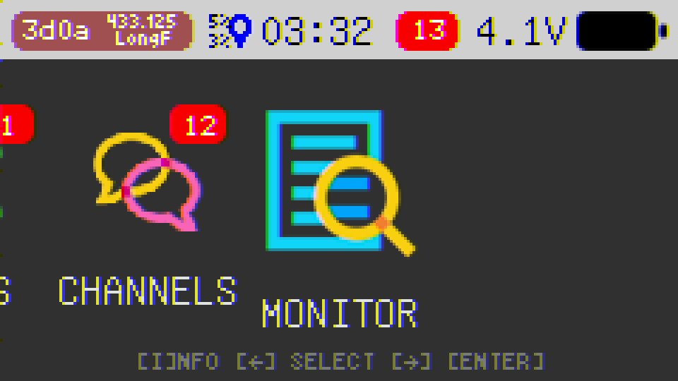
</p>

- Real-time TX/RX packet display with port labels (TEXT, POS, NODE, TELE, ROUT, TRAC, etc.)
- Color-coded direction, node badges, and SNR indicators
- From/To node name resolution from NodeDB
- Scrollable packet list with detail drill-down view
- Last 50 packets in a zero-heap ring buffer

### Settings

Complete device and mesh configuration.

<p align="center">
  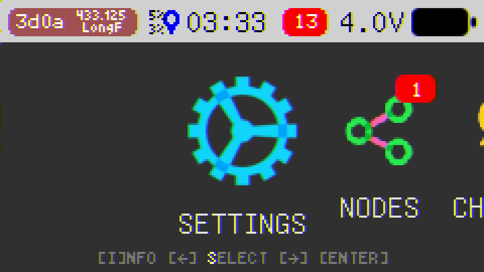
</p>

- System: brightness, volume, timezone
- LoRa: region, modem preset, TX power, hop limit
- Security: channel PSK management
- Node info: name, short name, role
- Position: GPS enable, fixed position, broadcast interval
- Telemetry: device metrics broadcast
- Export/Import settings to SD card
- Clear all nodes

## Hardware

### Required

| Component                 | Description                              |
| ------------------------- | ---------------------------------------- |
| **M5Stack CardPuter ADV** | ESP32-S3 portable terminal with keyboard |
| **LoRa CAP**              | M5Stack SX1262 LoRa module (868/915 MHz) |
| **SD Card**               | For profile, messages, and node database |

### Optional

| Component | Description                                                   |
| --------- | ------------------------------------------------------------- |
| **GPS**   | ATGM336H module (UART, 115200 baud) for live position sharing |

### Also Supported

| Board                  | Keyboard      | Status    |
| ---------------------- | ------------- | --------- |
| M5Cardputer (original) | IOMatrix      | Supported |
| M5Cardputer ADV        | TCA8418 (I2C) | Supported |

Keyboard driver is auto-detected at boot.

## Install

Beta version is available in **M5Apps** (Installer → Cloud → Beta tests).

Standalone version will be added to **M5Burner** soon.

> Look for M5Apps in M5Burner.

## Mesh Protocol

Built from scratch on ESP-IDF — not a fork of the Meshtastic firmware.

- **Encryption**: AES-CTR with channel PSK, X25519 public-key cryptography
- **Multi-channel**: Up to 8 channels with individual PSKs
- **Routing**: Hop-limit flooding (1–7 hops) with Meshtastic-compatible duplicate detection
- **Reliability**: ACK/NACK with automatic retries, implicit ACK via rebroadcast
- **Priority TX queue**: ACK > Routing > Admin > Reliable > Default > Background
- **Duty cycle**: Channel and air utilization tracking
- **Multi-region**: US, EU_433, EU_868, CN, JP, ANZ, KR, TW, RU, IN, and more
- **Packet encoding**: Nanopb (Protocol Buffers) for full Meshtastic wire compatibility

## Building from Source

### Prerequisites

- [ESP-IDF v5.5.x](https://docs.espressif.com/projects/esp-idf/en/v5.5.2/esp32s3/get-started/)
- ESP32-S3 target

### Build & Flash

```bash
idf.py set-target esp32s3
idf.py build
idf.py -p COMx flash monitor
```

### HAL Configuration

Hardware components can be individually toggled via menuconfig:

```bash
idf.py menuconfig
# Navigate to: HAL Configuration
```

| Option             | Default | Description                   |
| ------------------ | ------- | ----------------------------- |
| `HAL_USE_DISPLAY`  | on      | ST7789 display via LovyanGFX  |
| `HAL_USE_KEYBOARD` | on      | Keyboard input (requires I2C) |
| `HAL_USE_RADIO`    | on      | SX1262 LoRa radio             |
| `HAL_USE_SDCARD`   | on      | SD card (FAT)                 |
| `HAL_USE_GPS`      | on      | ATGM336H GPS                  |
| `HAL_USE_SPEAKER`  | on      | I2S audio output              |
| `HAL_USE_LED`      | on      | WS2812 RGB LED                |
| `HAL_USE_BAT`      | on      | Battery voltage monitor       |
| `HAL_USE_I2C`      | on      | I2C master bus                |
| `HAL_USE_BUTTON`   | on      | Home button                   |
| `HAL_USE_USB`      | on      | USB MSC host                  |
| `HAL_USE_WIFI`     | on      | WiFi                          |
| `HAL_USE_BLE`      | on      | Bluetooth Low Energy          |

## Project Structure

```
Plai/
├── main/
│   ├── apps/                  # Application layer
│   │   ├── launcher/          # Home screen & system bar
│   │   ├── app_nodes/         # Node list, DM, traceroute
│   │   ├── app_channels/      # Channel group chat
│   │   ├── app_monitor/       # Live packet feed
│   │   ├── app_settings/      # Configuration UI
│   │   └── utils/             # Shared UI components
│   ├── hal/                   # Hardware Abstraction Layer
│   │   ├── hal.h              # Base HAL class
│   │   ├── hal_cardputer.*    # M5Cardputer implementation
│   │   ├── display/           # LovyanGFX display driver
│   │   ├── keyboard/          # TCA8418 / IOMatrix drivers
│   │   ├── radio/             # SX1262 LoRa driver
│   │   └── ...                # GPS, speaker, LED, battery, etc.
│   ├── mesh/                  # Meshtastic protocol
│   │   ├── mesh_service.*     # Core mesh service
│   │   ├── node_db.*          # Node database (SD-backed)
│   │   ├── mesh_data.*        # Message store & packet log
│   │   └── packet_router.*    # Priority TX/RX queues
│   ├── meshtastic/            # Protobuf definitions (Nanopb)
│   ├── settings/              # NVS settings with cache
│   └── main.cpp               # Entry point
├── components/
│   ├── LovyanGFX/             # Display graphics library
│   ├── mooncake/              # App framework
│   └── Nanopb/                # Protocol Buffers
└── Kconfig.projbuild          # menuconfig HAL options
```

## Credits

- Fonts: [efont](https://openlab.ring.gr.jp/efont/) Unicode bitmap fonts from the Linux distribution
- Icons: Free icons by [Icons8](https://icons8.com)
- Platform: [M5Stack](https://m5stack.com/) M5Cardputer

## License

This project is licensed under the [GNU General Public License v3.0](https://www.gnu.org/licenses/gpl-3.0.html) — see [LICENSE](LICENSE) for details.
